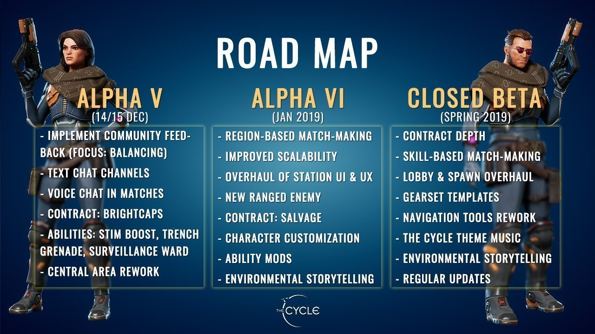
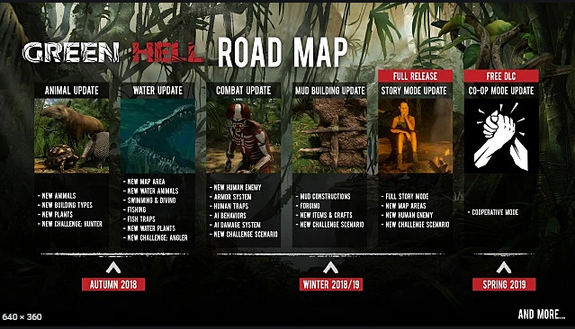
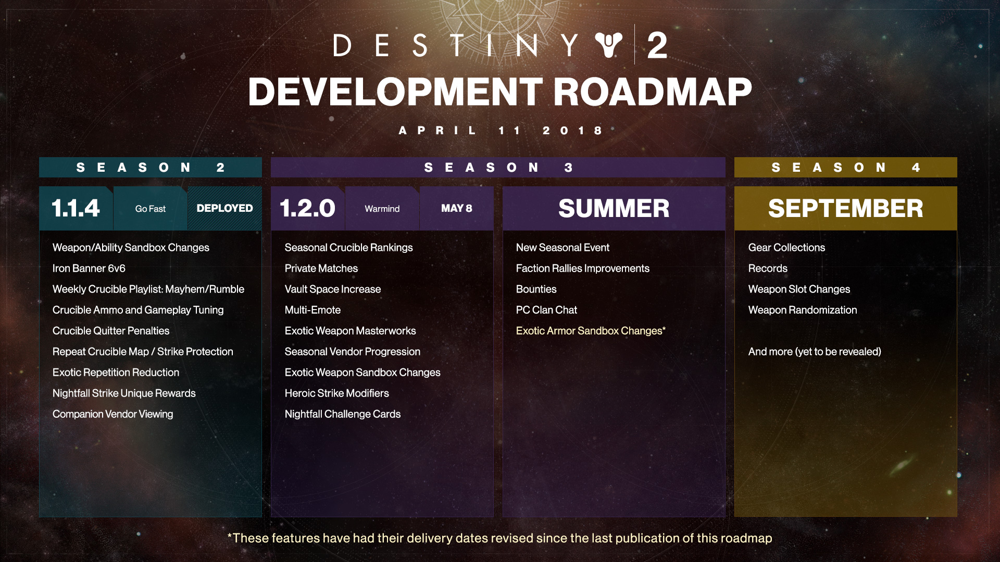
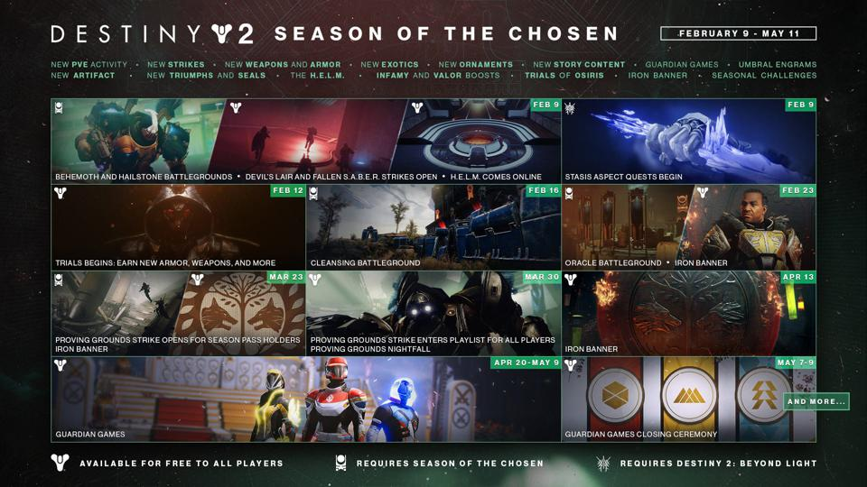
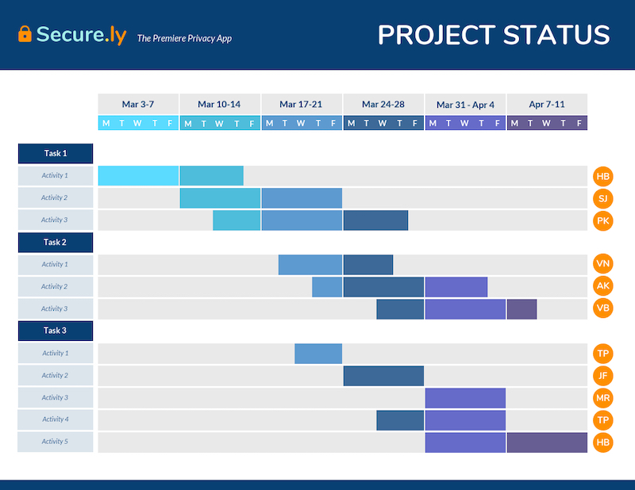
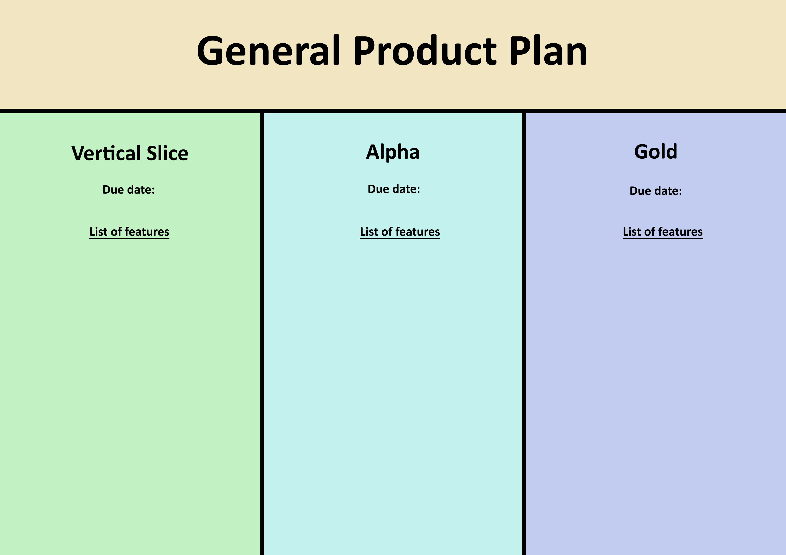
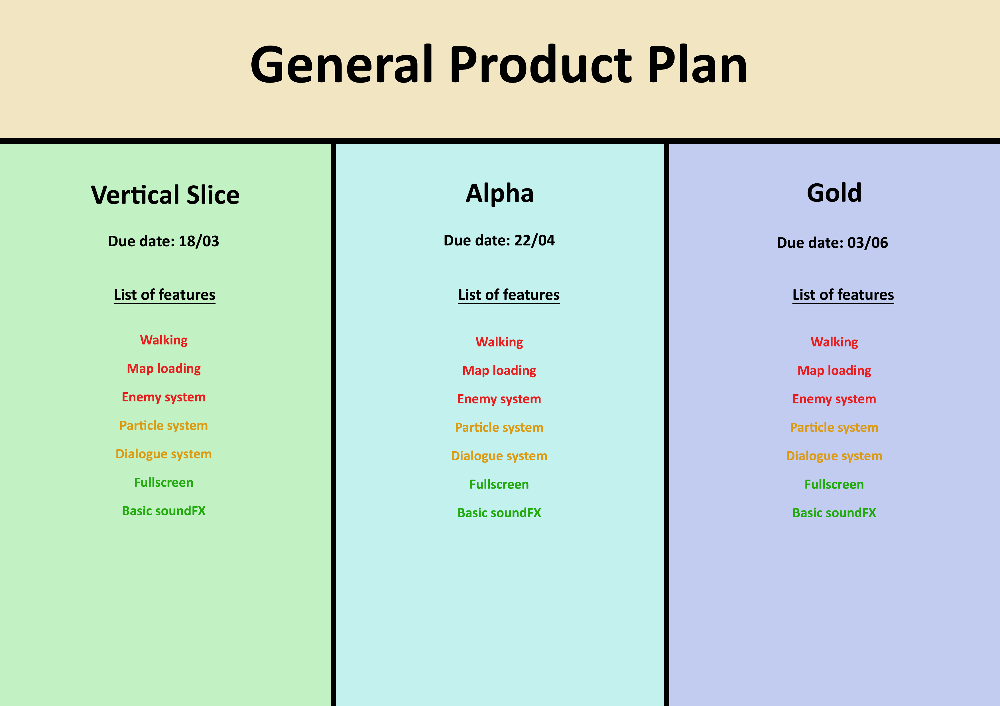
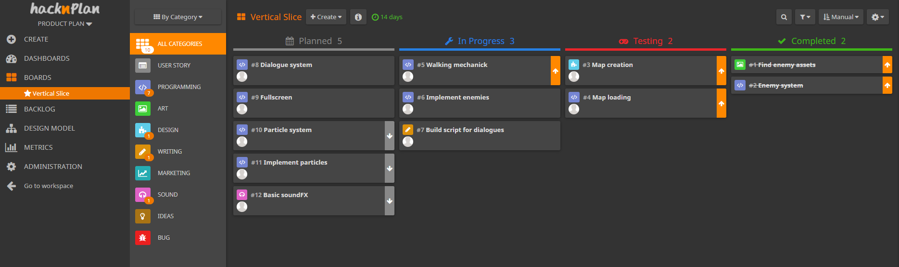

# INTRODUCTION

Every new product that is to be developed needs to have a plan in order to not fail during its production. In fact, according to Clayton Christensen, a Harvard Business School professor:
>Out of all the new items that are introduced to the market each year, 95% of them end up failing.

With that said, let’s explain what a **Production Plan** document (also known as Production Roadmap)  is, seeing it’s utilities and contents.
  

### ***Main purpose***

The main purpose of a Production Plan is to define a production strategy to develop a product or a part of it, taking into consideration the available resources, expected deadlines, how the budget should be managed, the target audience, and other important production information.

This is a very brief explanation of its main use, but the document also serves other important purposes that we’ll see later on.
  

### ***What does it contain?***

In order to accomplish its objectives, a Production Plan must contain different elements. These may vary depending on what the document is looking to accomplish. It could be a product features plan, a release plan or a sprint plan to name a few. Nevertheless, they all share some common elements, which are:
- An **objective** (build a release, implement a feature, etc...)
- The **tasks** needed to be done to fulfill the objective
- A **deadline** to accomplish it
- How **resources** are going to be managed on each task

It’s important to point out that resources don’t only mean money and time, but also people, software, hardware, and anything needed to develop the task.
  

### ***How and why is it useful?***

Building a plan for the production of your product is key in its development process because it provides a bunch of benefits, such as:
- Not having to rely on memory to know what you are supposed to do
- Everything gets documented so you can retrieve information at any time and, in case something goes wrong, you can see why that - happened
- It helps team organization
- It allows to minimize expenses and maximize profits by managing resources and budget correctly

Another important use of this document is to help investors be confident in the project, giving them a clear image of how everything is going to be done, and creating expectations on how the product is going to be on certain deadlines.
  

### ***How and when it should be updated?***
A Production Plan update rate is highly dependent on the size of the project that’s been developed. Let’s see this on an schematic way:
- Small project (up to 6 months): monthly update
- Medium project (1-2 years): quarterly update
- Big project (>2 years): yearly update

This is a huge simplification on how it generally works, but there’s other ways to check when to update. In video games, two examples of these could be:
- Update after each sprint meeting
- Update after each release

However, there's certain situations that will always force us to update the document. The most remarkable one is when there is a change on the budget or the deadlines. In this situation, a reorganization of resources is needed and, in most cases, we will have to leave aside some features of our product.

The way it should be updated is by communicating with the different departments to see what their capabilities are and how any problems that may appear, or already exist, can be solved.
It is also important that any important member of the company is present in this process as they are the ones with bigger knowledge on how the production should go, and could contribute with valid ideas and solutions.

One last thing that needs to be mentioned is that even when the product makes it into the market, it will probably still receive updates and new features. That means that the Production Plan should keep being updated.
   

# MARKET STUDY

Now that we know what a Product Plan is and how it’s done, let’s see some games approaches on it.

**The cycle**: this multiplayer first person shooter game uses a simple, but yet effective, plan that shows what should be added for the next release and its deadline.

It’s a great way to summarize all the content that has to be implemented and works really well on a project of any scale, though bigger AAA games might use a more complex system.
   

**Green Hell**: a survival video game that uses another common way to schedule the development. In this case, there is a list of updates, each with its own set of new content, and the deadlines are marked in year seasons.

This technique is normally used for medium or big games, but smaller ones don’t usually take that long to be developed.
   

**Destiny 2**: it is a huge game with a ton of content and it serves as a good example of how to develop a plan for production after the game releases.

Destiny 2, as shown in the image below, divides its plans by seasons, indicating what changes and new features are coming to the game in its future versions, or in a certain period of time (year season, month).

However, in order to promote future updates, Bungie (Destiny’s development company) creates a more detailed roadmap of what’s about to come in the next season, adding its duration, a simplified list of new features and changes, and a big image that shows the events that will occur in-game and when they will start.
  

   

# SELECTED APPROACH

Having seen other games approach on this document, let's see what could be the best way to build our own.

First of all, we have to consider a few things:
- We are developing a relatively small game
- There already are some deadlines established for each release/version of the project
- We are working on small teams (5-7 people)

Knowing that, we can straight up discard a seasonal divided Product Plan, as it is targeted to bigger projects with more extensive time limits.

Another important aspect that has to be covered is our resources.
- Do we have money to buy assets?
- Are we capable of creating our own assets?
- What is our expertise level on coding?
- Is there anyone on the team that has unique useful skills?

Given that we are in an academic situation, we’ll assume some things:
- We have to make the game without spending any money
- Time isn’t an abundant resource, so it's important to manage it correctly
- Our experience inside the game industry is limited, so we are a “junior” team of developers

Now that we have concretized our capabilities, let’s start building the document, or actually, documents. That’s right, we will use 2 different documents to better organize the project.

**Document 1 (general production plan)**:
This document will be a general view on how the development process should go.

- **Content**: the data displayed here will be the different releases (with their deadlines) and the features each of them should contain. This way we can look at this plan anytime and see if we are on the right pace.

- **Updates**: this document should be updated mainly on two occasions:
  - When we are handed the information about the next release, adding its features to the document.
  - If we don’t have time to implement a feature in its corresponding release and we have to move it to the next one.

**Document 2 (release production plan)**:
Since we are developing a small game, we can center our plan around the next upcoming release, starting off with the Vertical Slice.

- **Content**: the information holded on the document will be the tasks that have to be completed in order to implement the different features required on the game when the release is published.

- **Team organization**: for a better team organization, each task will be assigned to one or various members so the development process is less chaotic.

- **Task management**: to correctly manage the state of each task a good idea would be to use a kanban board. There are online webs, such as Trello or HacknPlan that already let you organize your project this way. You can use whatever you’re most comfortable with, but HacknPlan is the one that I recommend.
  - There will be 4 different states for the tasks: to do, in process, to revise, done.
  - The order in which these tasks are going to be completed is from most to less important. If a new important task (such as fixing a bug) suddenly appears, and everyone is already occupied with other ones, someone will have to stop working on their task and complete the important one first. Note that HacknPlan let’s you add an importance level to each task.
  - If a task is complex, it may need a small description.

- **Updates**: this document will be updated after each release is published. The new information will be the tasks needed to add the next features to the game, but also to solve any problems that may have occurred on the previous release.
 

Another way companies liek to plan their production is by using a Gantt Chart. It's a way to set when each task should start and how long it should take.

   

# POSSIBLE IMPROVEMENTS

There are a few possible improvements to the solution provided that could make the development process easier, such as:

- **Time**:
  - Adding an expected time to complete each task
  - Calculate the time it took to actually complete it
  - This information can be used later on to get various analytics on the workflow

- Consider each team member’s **knowledge** on various subjects. That means that someone could do programming tasks quicker and design tasks more slowly.
- Consider the **target audience** as to prioritize certain tasks that could make the finished game more appealing to them.
   

# EXAMPLES

Here are the templates we will use as Production Plans:

- **General Plan**:
  - PDF: [Light themed](https://github.com/Denisdrk6/ProductionPlan/blob/main/docs/templates/Template_general_light.pdf) / [Dark themed](https://github.com/Denisdrk6/ProductionPlan/blob/main/docs/templates/Template_general_dark.pdf)
  - [Excel](https://github.com/Denisdrk6/ProductionPlan/blob/main/docs/templates/Template_general.xlsx)
  - [Photoshop](https://github.com/Denisdrk6/ProductionPlan/blob/main/docs/templates/Photo_general.psd)

  

- **Release Plan**:
  - PDF: [Light themed](https://github.com/Denisdrk6/ProductionPlan/blob/main/docs/templates/Template_release_light%20.pdf) / [Dark themed](https://github.com/Denisdrk6/ProductionPlan/blob/main/docs/templates/Template_release_dark%20.pdf)
  - [Excel](https://github.com/Denisdrk6/ProductionPlan/blob/main/docs/templates/Template_release.xlsx)
  - [Trello](https://trello.com/b/E997Hamg/release-product-plan)
  - HacknPlan:

   

### **MarkDown template [HERE](https://github.com/Denisdrk6/ProductionPlan/blob/main/docs/templates/Template.md)**

# DOCUMENTATION & REFERENCES

- [Class presentation](https://github.com/Denisdrk6/ProductionPlan/blob/main/docs/Presentation.pdf) in PDF

### ***Tools***
- [Trello](https://trello.com/)
- [HacknPlan](https://hacknplan.com/)

### ***References***
- [How to create a product plan](https://blog.bit.ai/product-plan/)
- [Guidelines for developing a production plan](https://resources.sei.cmu.edu/asset_files/TechnicalReport/2002_005_001_14024.pdf)
- [Examples of product roadmaps](https://www.productboard.com/blog/4-roadmap-examples/#7-examples-of-effective-product-roadmaps)
- [Tips for a good production plan](https://www.bdc.ca/en/articles-tools/operations/operational-efficiency/production-plan-top-tips-improving-operations)
- [Destiny 2 development roadmap](https://www.bungie.net/en/News/Article/46735)
- [The Cycle development roadmap](https://thecycle.game/development-roadmap/)
- [Green Hell development roadmap](https://www.gameskinny.com/xgvcl/green-hell-developers-release-game-dev-roadmap)
